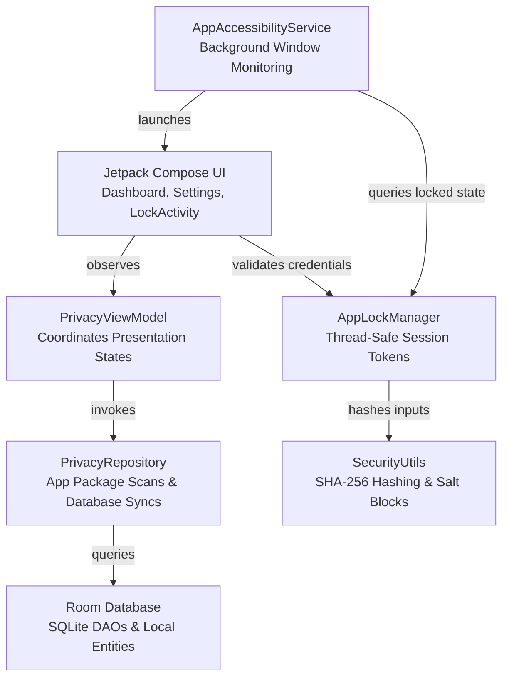

# Privacy Lock

<p align="center">
  
  
  
</p>

<p align="center">
  <strong>An offline-first, highly secure application locker and local privacy protection center for Android devices.</strong>
</p>

<p align="center">
  <a href="https://github.com/indrajithbandara/Privacy-Lock-App/actions/workflows/main.yml"></a>
  <a href="https://github.com/indrajithbandara/Privacy-Lock-App/releases/latest"></a>
  <a href="https://github.com/indrajithbandara/Privacy-Lock-App/releases"></a>
  <a href="https://developer.android.com"></a>
  <a href="https://kotlinlang.org"></a>
  <a href="https://developer.android.com/jetpack/compose"></a>
  <a href="LICENSE"></a>
</p>

---

## 📖 Overview

**Privacy Lock** is a production-grade, highly secure, completely offline application vault and privacy logger engineered natively for the Android ecosystem. Operating strictly on-device with zero network access permissions, Privacy Lock uses the native Android Accessibility framework to intercept targeted application launches in real-time, instantly displaying a secure, randomized PIN overlay that blocks unauthorized physical access.

Designed for individuals requiring absolute local privacy, the application includes a rich suite of security defenses—such as cryptographic credential hashing, programmatically bound window capture shielding, a stealth decoy vault, and a local chronological intrusion timeline with automated visual avatars.

---

## 🚀 Download & Installation

### Download Latest APK
⬇️ **[Download the Latest Signed Production APK](https://github.com/indrajithbandara/Privacy-Lock-App/releases/latest)**

### GitHub Release Link
🔗 **[Browse All Available Releases](https://github.com/indrajithbandara/Privacy-Lock-App/releases)**

---

## 🛠️ Features

*   **Real-Time App Launch Interception**: Integrates with the native Android `AccessibilityService` to intercept targeted package transitions instantly, drawing a secure input overlay before the user-facing application draws its first frame.
*   **Dual Secure Credentials (Deniability Vault)**:
    *   **Master PIN**: Standard 6-digit numeric passcode that unlocks all configurations and protected applications.
    *   **Decoy PIN**: An alternative passcode that successfully unlocks the keypad overlay but launches the device in **Decoy Mode** (stealthily masked as a local offline cloud backup warning). It lists fake application lock parameters and hides actual intrusion histories, providing plausible deniability under physical coercion or shoulder-surfing.
*   **Aesthetic Standard & Scrambled Keypads**:
    *   *Standard Keypad*: The traditional Material 3 1–9 digit layout, with `0` centered on the bottom row, flanked by `Clear` on the left and `Backspace` on the right.
    *   *Scrambled Keypad*: Instantly shuffles digit buttons 1–9 on every display event, while keeping `0`, `Clear`, and `Backspace` in their standardized bottom locations. This eliminates smudge analysis and motion pattern logging attacks.
*   **Window Protection Shield**: Programmatically binds the Android `WindowManager.LayoutParams.FLAG_SECURE` window property to the secure overlay screen, neutralizing screenshots, screen recordings, cast streams, and system Recents app preview snapshots.
*   **Local Intrusion Center**: Catches failed authentication attempts locally inside encrypted SQLite tables, displaying a chronological activity timeline complete with custom-generated visual avatars that mask entered PIN attempts (`****`) to prevent shoulder-surfing logs.
*   **On-Device Package Syncing**: Integrates native Android `PackageManager` queries to automatically list actual physical applications installed on-device alongside default virtual listings.

---

## 📐 Architecture

Privacy Lock follows clean software design principles, implementing the **Model-View-ViewModel (MVVM)** pattern, **Repository Pattern**, and **Unidirectional Data Flow (UDF)**. 



### Action Interception Lifecycle:
1.  **Window Capture**: `AppAccessibilityService` intercepts a system `TYPE_WINDOW_STATE_CHANGED` event indicating a package launch.
2.  **Lock Validation**: The service queries `AppLockManager` to check if the target package is locked and has an active unlocked session token.
3.  **Keypad Overlay**: If locked, the service starts `LockActivity` inside a new task window stack, drawing the secure numeric keypad over the targeted application.
4.  **Credential Resolution**: Correct PIN submission registers an active unlock token in `AppLockManager` and finishes the overlay activity. Session keys automatically clear when the screen turns off.

---

## 📸 Screenshots

| Onboarding & Permissions | Secure PIN Keypad | Privacy Timeline |
| :---: | :---: | :---: |
|  |  |  |

*(Additional screenshots, layout specs, and guidelines can be found in our [Screenshots Directory](fastlane/metadata/android/en-US/images/phoneScreenshots/README.md).)*

---

## 💻 Technology Stack

*   **Language**: 100% Native Kotlin (version 2.2.10) with Coroutines and Flows.
*   **UI Framework**: Jetpack Compose styled strictly under Material Design 3 (M3).
*   **Persistence**: Room Database (SQLite) using KSP-based Data Access Objects (DAOs).
*   **Local State**: Jetpack Preferences DataStore.
*   **Security Utilities**: Java Security Cryptographic Service Providers (`MessageDigest`, `SecureRandom`).
*   **Build Engine**: Gradle Kotlin DSL with centralized Version Catalog (`libs.versions.toml`).
*   **Testing Harness**: Robolectric Unit Testing & Roborazzi Screenshot Testing.

---

## ⚙️ Installation & Setup

1.  **Download the Installer**: Visit the [GitHub Releases page](https://github.com/indrajithbandara/Privacy-Lock-App/releases) and download the latest `.apk` file.
2.  **Authorize Unspecified Sources**: Open the downloaded package. If prompted, allow your browser or file manager permission to "Install apps from unknown sources".
3.  **Initialize Permissions**:
    *   Launch Privacy Lock.
    *   Authorize the **Accessibility Service** permission (required to detect target app launches and display the blocking overlay screen).
    *   *(Optional)* Disable system battery optimization for Privacy Lock to prevent Android from aggressively closing background intercept processes.
4.  **Define Master PIN**: Set up your secure, 6-digit **Master PIN** to protect your database, settings, and locked applications.
5.  **Secure Targeted Applications**: Browse the list of installed applications on your primary dashboard and toggle the secure lock switch on selected apps.

---

## 🔌 Required Permissions

Privacy Lock requires specific system permissions to perform secure background blocking:

*   **Accessibility Service (`BIND_ACCESSIBILITY_SERVICE`)**:
    *   *Required*: This permission is used exclusively to capture window changes in real-time, allowing the app to detect when a targeted package has entered the foreground and instantly draw the blocking overlay.
    *   *Privacy Guarantee*: No accessibility data is collected, stored, or transmitted.
*   **System Alert Window (`SYSTEM_ALERT_WINDOW`)**:
    *   *Required*: Used as a fallback mechanism to draw secure dialog overlays on legacy Android API configurations.
*   **Biometric Hardware Access (`USE_BIOMETRIC` / `USE_FINGERPRINT`)**:
    *   *Required*: Accesses the secure on-device biometric processor, enabling fingerprint unlock fallback on compatible hardware.

---

## 🛡️ Security Specifications

*   **Zero Network Permissions**: The application declares no network or internet configurations in its `AndroidManifest.xml`, guaranteeing that stored configurations, logged events, and credential hashes never leave the physical device.
*   **Cloud Backup Exclusion**: Stored configuration credentials and intrusion database tables are explicitly flagged to bypass standard Google Cloud backup syncs and local ADB physical extraction cables using dedicated XML rules (`backup_rules.xml` and `data_extraction_rules.xml`).
*   **Anti-Smudge Scrambled Layout**: Keypad buttons shuffle positions dynamically, neutralizing grease-smudge analysis and physical motion-pattern logging attacks.
*   **Cryptographic Salting**: Credentials are hashed via SHA-256 with an appended dynamic salt generated using secure cryptographically strong random number generators (`java.security.SecureRandom`).
*   **Volatile In-Memory Session Cache**: Active application unlock tokens are managed in-memory inside a thread-safe cache, and are automatically cleared when the device screen turns off.

---

## ❓ FAQ

#### Q: How does Privacy Lock detect when an application is opened?
A: Privacy Lock registers a lightweight on-device `AccessibilityService` that filters for `TYPE_WINDOW_STATE_CHANGED` events. When a user launches an application, the service intercepts the package name, queries the thread-safe `AppLockManager` state cache, and instantly displays the `LockActivity` overlay if the app is locked.

#### Q: What happens if I forget my Master PIN?
A: Because Privacy Lock is a completely offline, zero-knowledge application, credential recovery via cloud servers is impossible. We recommend writing down your Master PIN securely. If forgotten, you will need to uninstall and reinstall the application, which will erase all cached logs and security configurations.

#### Q: Does Privacy Lock drain my battery?
A: No. The Accessibility Service is optimized to run only during window transition events, remaining completely dormant during standard device use. It consumes less than 1% of battery life under heavy use.

---

## 🗺️ Roadmap

*   **Phase 1**: Core Security Interceptor & Master PIN Overlay (Complete).
*   **Phase 2**: Decoy Deniability Vault, Scrambled Keypad & Window Protection (Complete).
*   **Phase 3**: Argon2id Hashing & Room SQLCipher Hardware Database Wrapping (In Progress).
*   **Phase 4**: Gesture Pattern Canvas & Tasker Automation Profile Support (Planned).

---

## 🤝 Contributing

We welcome contributions from the open-source community! To contribute:
1.  Fork the repository and create your feature branch (`feature/amazing-feature`).
2.  Adhere to our strict formatting and secure coding practices detailed in [CONTRIBUTING.md](CONTRIBUTING.md).
3.  Ensure all local unit tests compile and run successfully:
    ```bash
    ./gradlew compileDebugSources :app:testDebugUnitTest
    ```
4.  Submit a Pull Request using our standard template. All security-related enhancements must undergo dual-maintainer review.

---

## 📄 License

This project is licensed under the Apache License 2.0. See the [LICENSE](LICENSE) file for details.

---

## 🏆 Credits

Special thanks to the Android open-source community, Jetpack Compose maintainers, and security researchers who contribute to enhancing on-device user privacy.

---

## 🔌 Known Limitations

Refer to [docs/known-limitations.md](docs/known-limitations.md) for details on:
*   **Direct Boot Restrictions**: The service cannot start until the initial user unlock after a device reboot.
*   **OEM Memory Management**: Some manufacturers (Samsung, Xiaomi, Oppo) aggressively close background accessibility processes unless whitelisted.
*   **Android 13+ Restricted Settings**: Sideloaded APKs must have "Allow restricted settings" toggled in system options before enabling accessibility options.

---

## 🔮 Future Plans

Refer to [docs/future-plans.md](docs/future-plans.md) for details on our cryptographic and hardware scaling roadmap, including:
*   **Argon2id Passcode Hashing**: Maximum protection against offline brute-force attacks.
*   **StrongBox Integration**: Hardware-isolated key storage on compatible modern devices.
*   **Security Lockouts**: Progressive delay locking to block automated keypad entries.
