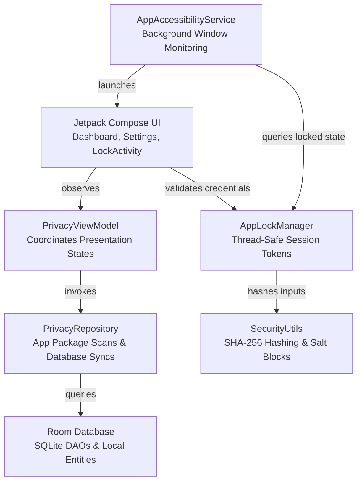

# Privacy Lock

[](https://github.com/example/privacy-lock/actions)
[](https://github.com/example/privacy-lock/releases/latest)
[](https://github.com/example/privacy-lock/releases)
[](https://github.com/example/privacy-lock/releases)
[](LICENSE)
[](https://developer.android.com)
[](https://kotlinlang.org)
[](https://developer.android.com/jetpack/compose)

Privacy Lock is an offline-first, highly secure application locker and local privacy protection center for Android devices. Engineered strictly as a native system utility, Privacy Lock uses standard Android background services to intercept target application launches and display a secure numeric authentication overlay. This ensures your private application data remains isolated and protected on-device without relying on external network dependencies or displaying unsolicited advertisements.

---

## 📦 Download

⬇️ **[Download the latest APK from GitHub Releases](https://github.com/example/privacy-lock/releases)**.

Every release package is fully compiled, signed, and includes all necessary assets for verification and installation. In every official release, you will find:

*   **Latest Release**: The highly optimized production version of the app.
*   **Download APK**: Direct installable package for modern Android devices (`.apk`).
*   **Android App Bundle (AAB)**: The standard publishing package format (`.aab`).
*   **Release Notes**: Comprehensive list of features, bug fixes, and details corresponding to the release.
*   **SHA-256 Checksum**: Cryptographic checksum signature used to verify file integrity and protect against tampering.
*   **Source Code**: Complete snapshot of the repository source code at the release tag (`.zip` / `.tar.gz`).

---

## 🚀 Installation & Setup

Get Privacy Lock up and running on your Android device in five simple steps:

1.  **Download the APK**: Visit the [GitHub Releases page](https://github.com/example/privacy-lock/releases) and download the latest `.apk` file to your device.
2.  **Install the APK**: Open the downloaded file. If prompted, allow your browser or file manager to "Install apps from unknown sources".
3.  **Enable Required Permissions**:
    *   Launch Privacy Lock.
    *   Authorize the **Accessibility Service** permission (required to detect target app launches and display the blocking overlay screen).
    *   (Optional) Enable battery optimization exclusion under system settings to prevent Android from closing the background service.
4.  **Configure PIN**:
    *   Set up your secure **Master PIN** (6 digits) to secure your locked applications.
    *   (Optional) Set up a separate **Decoy PIN** to protect you under shoulder-surfing or coercive conditions.
5.  **Start Locking Applications**:
    *   From the primary dashboard, browse the list of installed applications.
    *   Toggle the secure lock switch on the apps you want to protect (e.g., Settings, Play Store, Messaging apps).

---

## 🏗️ Releases

Every official version release is published under the [GitHub Releases Page](https://github.com/example/privacy-lock/releases). Every single release contains:

*   **Optimized APK**: Production-ready compiled installer.
*   **Android App Bundle (AAB)**: Standard distribution bundle.
*   **Comprehensive Changelog**: Historical tracking of all adjustments, enhancements, and corrections.
*   **SHA-256 Checksum**: Safe, verifiable cryptographic signatures of all compiled binaries.
*   **Release Notes**: Summary of major feature changes, performance improvements, and contributor credits.

---

## 🏪 Distribution Platforms

### 🤖 Google Play Store
**Coming Soon on Google Play**

<!-- [](https://play.google.com/store) -->

### 🟢 F-Droid
**Coming Soon on F-Droid**

<!-- [](https://f-droid.org) -->

---

## 🛡️ Security & Integrity Verification

To guarantee that the APK you are installing has not been modified or tampered with, you should verify its integrity using its SHA-256 checksum.

### How to Verify APK Integrity:
1.  Download the `.apk` file and its corresponding `.sha256` checksum file (or locate the checksum in the GitHub Release details).
2.  Open your terminal or command prompt and run the following command depending on your operating system:
    *   **Linux**:
        ```bash
        sha256sum privacy-lock-release.apk
        ```
    *   **macOS**:
        ```bash
        shasum -a 256 privacy-lock-release.apk
        ```
    *   **Windows (PowerShell)**:
        ```powershell
        Get-FileHash privacy-lock-release.apk -Algorithm SHA256
        ```
3.  Compare the printed hash output with the official checksum published on the GitHub Releases page. If they match exactly, your installation file is authentic and safe to install.


---

## 📸 Screen Showcases

| Onboarding & Permissions | Secure PIN Keypad | Privacy Timeline |
| :---: | :---: | :---: |
|  |  |  |

*(Visual asset walkthroughs, detailed wireframe specs, and capture guidelines can be found in the [Screenshots Directory](screenshots/README.md).)*

---

## 🔍 Core Philosophy & Design Constraints

This utility is built with strict privacy and architectural boundaries:

1. **Zero Network Permissions**: The app declares no network configurations or internet permissions in its `AndroidManifest.xml`, ensuring your data never leaves your device.
2. **Explicit Cloud Bypass**: Stored PIN hashes and local intrusion databases are explicitly flagged to bypass system-level cloud backups and ADB physical extraction cables via `backup_rules.xml` and `data_extraction_rules.xml`.
3. **Native Material 3 Interface**: Styled using a customized Material 3 Sage Green color palette with responsive scaling to look and feel like a native part of the Android operating system.

---

## 🛠️ Features

* **App Launch Interception**: A lightweight background accessibility service monitors foreground changes on-device to immediately display a blocking authentication keypad over target applications.
* **Dual Secure Credentials**: Define a standard 6-digit **Master PIN** alongside an alternative **Decoy PIN**. Both pins successfully unlock the interface, but the Decoy PIN logs a standard decoy session to protect you from shoulder-surfing and coercion.
* **Standard & Scrambled Keypads**: Features a customizable numeric PIN layout:
  * **Standard Mode**: Digits 1–9 arranged sequentially, with `0` always centered in the bottom row, flanked by `Clear` on the left and `Backspace` on the right.
  * **Randomized Keypad**: Shuffles digits 1–9 on every display event to prevent finger-smudge analysis and motion pattern logging, while keeping `0`, `Clear`, and `Backspace` securely in their standard bottom positions.
* **Window Protection Shield**: Programmatically binds the standard Android `WindowManager.LayoutParams.FLAG_SECURE` window property to the secure overlay screen to disable screenshots, screen recorders, and task preview snapshots in the system Recents carousel.
* **Local Intrusion Center**: Logs failed authentication attempts inside local encrypted SQLite files, displaying a chronological timeline with custom-generated visual avatars to protect against physical intruders.
* **On-Device Package Syncing**: Integrates native Android `PackageManager` scans to automatically list physical apps installed on-device alongside default virtual listings.

---

## 📐 Architecture Overview

Privacy Lock is structured around clean, predictable Model-View-ViewModel (MVVM) patterns:



### Flow of Action
1. **Detection**: `AppAccessibilityService` captures a `TYPE_WINDOW_STATE_CHANGED` event indicating a package launch.
2. **Evaluation**: The service queries `AppLockManager` to check if the target package is locked and has an active unlocked session token.
3. **Overlay**: If locked, the service starts `LockActivity` inside a new task window stack, placing the secure numeric keypad over the targeted app.
4. **Resolution**: Entering the correct PIN registers an active unlock token inside `AppLockManager` and finishes the overlay activity. Session keys automatically clear when the device screen turns off.

---

## 📂 Directory Structure

Key modules, source packages, and configurations included in this repository:

```
├── app/
│   ├── src/main/
│   │   ├── java/com/example/
│   │   │   ├── MainActivity.kt        # Entry point configuring navigation and starting components
│   │   │   ├── LockActivity.kt        # Overlay activity handling security keypad inputs and pin checking
│   │   │   ├── data/
│   │   │   │   ├── AppDatabase.kt     # Room database builder and singleton generator
│   │   │   │   ├── Daos.kt            # SQL data access queries (LockedApp, SecurityConfig, IntruderSelfie, TimelineEvent)
│   │   │   │   ├── Entities.kt        # Local schema definitions representing database tables
│   │   │   │   └── PrivacyRepository.kt # Repository executing device app syncs and DB transactions
│   │   │   ├── security/
│   │   │   │   ├── AppAccessibilityService.kt # Core system interceptor capturing window event changes
│   │   │   │   ├── AppLockManager.kt   # Local state controller managing locked app packages and live tokens
│   │   │   │   └── SecurityUtils.kt   # Hashing processes (SHA-256) and explicit system settings intent launchers
│   │   │   └── ui/
│   │   │       ├── PrivacyViewModel.kt # ViewModel managing screen states and UI event streams
│   │   │       ├── components/
│   │   │       │   └── CommonComponents.kt # Standard elements (SecureKeypad, AppIcon renderers)
│   │   │       └── screens/
│   │   │           ├── DashboardScreen.kt # Displays current locked apps and interactive phone simulation
│   │   │           └── PrivacyCenterScreen.kt # Details system status indicators, permissions checks, and logs
│   │   └── res/
│   │       ├── xml/
│   │       │   ├── accessibility_service_config.xml # Configures target window event filters for background lock triggers
│   │       │   ├── backup_rules.xml   # Explicitly excludes databases from cloud sync files
│   │       │   └── data_extraction_rules.xml # Prevents database exfiltration via local physical backup cables
│   │       └── values/
│   │           └── strings.xml        # Contains application strings and system services definitions
│   └── build.gradle.kts               # Core Gradle build script with library dependencies
└── gradle/
    └── libs.versions.toml             # Centralized version catalog managing plugin configurations
```

---

## 🚀 Getting Started

### Prerequisites
* **JDK 17** or higher
* **Android SDK Level 34** or higher
* **Gradle 8.0** or higher

### Compiling and Running
Run the following Gradle commands from the root directory to manage and compile the application:

```bash
# Clean and compile debug package
./gradlew clean assembleDebug

# Compile release package (generates unsigned release APK)
./gradlew assembleRelease

# Verify linter rules across source files
./gradlew lintDebug

# Run Unit and local Robolectric tests on JVM
./gradlew :app:testDebugUnitTest
```

---

## 📖 Complete Documentation

Explore the comprehensive guides organized in the repository:
* 📘 **[Frequently Asked Questions](FAQ.md)**: Frequently asked questions for users, developers, and security researchers.
* 🛠️ **[Support Guidelines](SUPPORT.md)**: Official channels, triage processes, and known platform limitations.
* 🤝 **[Contributing Guide](CONTRIBUTING.md)**: Coding standards, pull request checklists, and commit formatting rules.
* 🛡️ **[Security Policy](SECURITY.md)**: Vulnerability disclosure policies and cryptographic standards.
* 📜 **[Code of Conduct](CODE_OF_CONDUCT.md)**: Community rules and behavior standards.
* 🗺️ **[Development Roadmap](ROADMAP.md)**: Near-term, mid-term, and long-term milestones.
* 🔄 **[Changelog](CHANGELOG.md)**: Keep track of every major version change.

---

## 📄 License

This project is licensed under the Apache License 2.0. See the [LICENSE](LICENSE) file for complete details.
