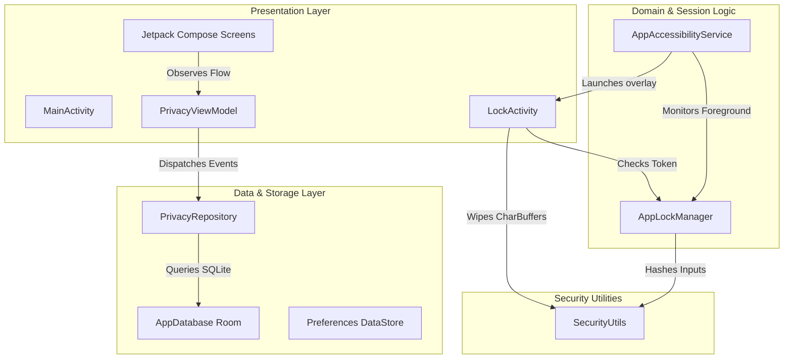
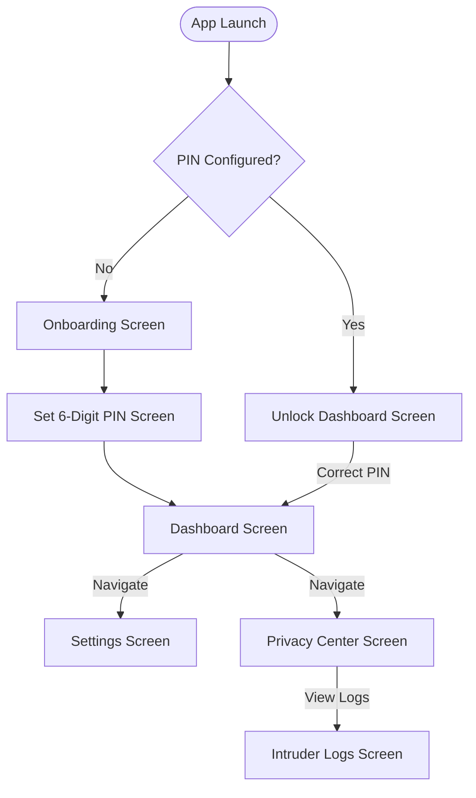
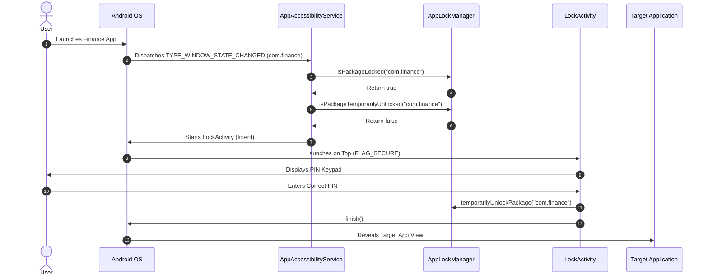
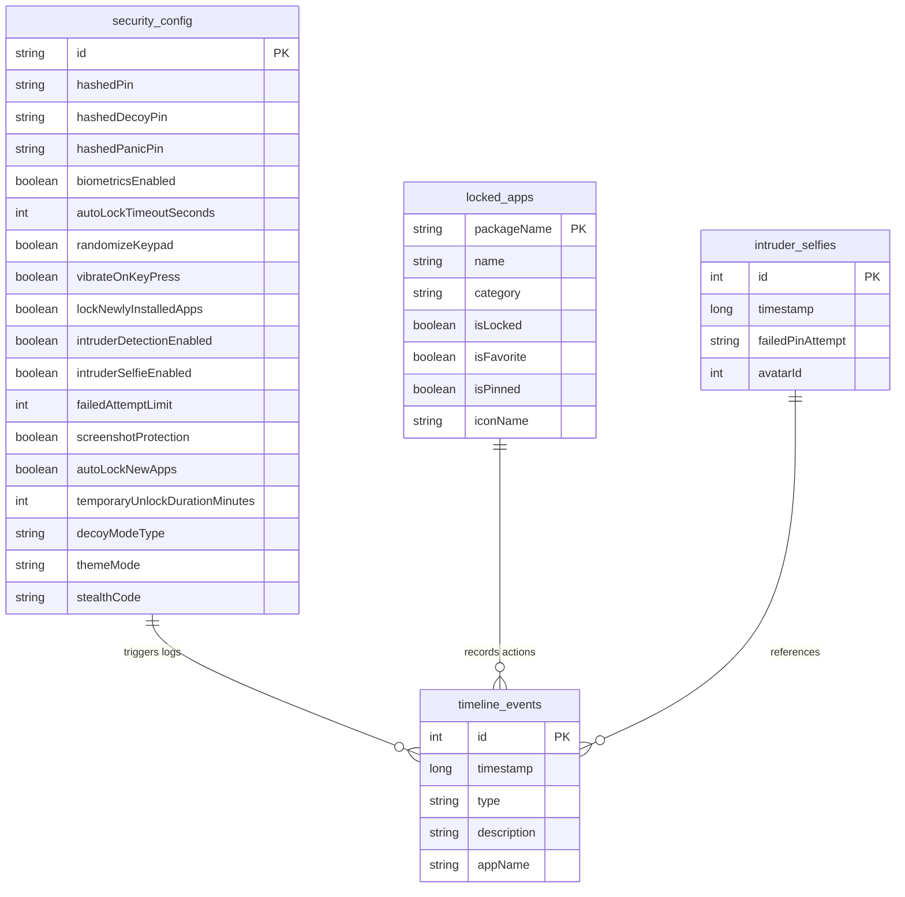
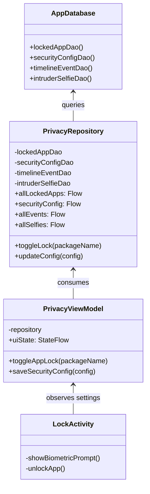
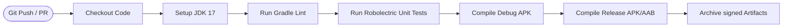

# Privacy Lock App Architecture Guide

This document provides a deep, production-grade architectural blueprint of **Privacy Lock**, an offline-first Android security application. It outlines the structural design, design patterns, internal threads, component interactions, and execution lifecycles that govern the app's secure runtime execution.

---

## 🏗️ 1. Core Architectural Overview

Privacy Lock is built on clean, decoupled architecture principles, combining **Model-View-ViewModel (MVVM)**, the **Repository Pattern**, and **Unidirectional Data Flow (UDF)**. 

To ensure maximum security and efficiency, the application is strictly divided into three layers:
1. **Presentation Layer (UI & Jetpack Compose)**: Houses composable screens, theme managers, and custom widgets. It is entirely stateless, relying on the `PrivacyViewModel` to expose UI state and capture user interactions.
2. **Domain/Business Logic Layer (ViewModels & Managers)**: Manages lock status, monitors background activities, processes cryptographic hashes, and coordinates configuration sessions.
3. **Data Layer (Room Database & DataStore)**: Handles local SQLite queries, stores app package lists, records intruder logs, and persists encrypted user configurations.

---

## 📂 2. Presentation Layer & Navigation Flow

The UI uses **Jetpack Compose** with a centralized `PrivacyViewModel` providing the state. The main application navigation runs on type-safe Compose routes, while the blocking overlay keypad runs as a separate task inside `LockActivity`.

### Navigation Flow Diagram
This diagram outlines the screens, navigation paths, and conditional checks required to transition from the setup wizard to the protected dashboards.

---

## 🛡️ 3. App Interceptor & Background Execution Thread

The core capability of Privacy Lock is launching a secure lock screen over protected applications when they enter the foreground. This process is governed by the native Android `AppAccessibilityService` and coordinated with a thread-safe `AppLockManager` session cache.

### Interception Sequence diagram
The sequence below illustrates the step-by-step event flow when a user launches a locked application (e.g., a Finance app):

---

## 💾 4. Data Layer Architecture (Room Database Schema)

The persistent storage structure relies on a single Room Database instance `privacy_lock_db` with four core tables, fully synchronized in real-time.

---

## ⚙️ 5. MVVM & Repository Decoupling Pattern

To prevent code duplication, `PrivacyRepository` exposes cohesive Kotlin `Flow` structures and executes all operations asynchronously on the IO dispatcher (`Dispatchers.IO`). view models collect these data streams and transform them into Compose state wrappers using `stateIn`.

### MVVM Interactions

---

## 🚀 6. CI/CD DevOps Pipeline Architecture

The release automation system is built on GitHub Actions, running tests, audits, and compilation suites inside isolated environments.

