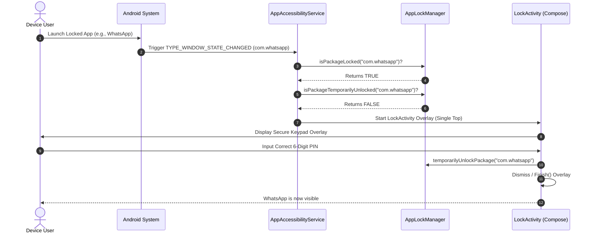

# Architecture

Privacy Lock is engineered following modern Android Architectural Guidelines, utilizing an offline-first **MVVM (Model-View-ViewModel)** design, a unified **Repository Pattern**, **Jetpack Compose** for reactive UI rendering, and Kotlin **Coroutines/Flows** for thread-safe state synchronization.

---

## Architectural Blueprint

The application architecture enforces strict separation of concerns, ensuring that UI components observe state changes without direct write access to database entities.

```
+----------------------------------------------------------------------------+
|                                 UI LAYER                                   |
|                                                                            |
|   +-----------------------+              +-----------------------------+   |
|   |    Compose Screens    | <----------> |     PrivacyViewModel        |   |
|   |  (Settings, Lock UI)  |              |                             |   |
|   +-----------------------+              +-----------------------------+   |
+---------------------------------------------------------^------------------+
                                                          |
                                                          v
+----------------------------------------------------------------------------+
|                                DOMAIN & DATA                               |
|                                                                            |
|                      +------------------------------+                      |
|                      |      PrivacyRepository       |                      |
|                      +------------------------------+                      |
|                                     |                                      |
|                 +-------------------+-------------------+                  |
|                 |                                       |                  |
|                 v                                       v                  |
|     +-----------------------+               +-----------------------+      |
|     |     Room Database     |               |  PreferencesDataStore |      |
|     |  (LockedApp, Config)  |               | (Screenshot Settings) |      |
|     +-----------------------+               +-----------------------+      |
+----------------------------------------------------------------------------+
```

---

## Architectural Components

### 1. View Layer (Jetpack Compose)
All screens are constructed declaratively using Jetpack Compose:
* **Theming**: Configured dynamically in `Theme.kt` using Material 3 color schemes (`dynamicLightColorScheme` or `dynamicDarkColorScheme` for Android 12+, falling back to custom brand pairings on older versions).
* **State Consumption**: Composables consume immutable state from the ViewModel via `.collectAsStateWithLifecycle()`, assuring that state updates are paused when the UI is in the background.

### 2. ViewModel Layer (`PrivacyViewModel`)
The `PrivacyViewModel` is a centralized coordinator extending `AndroidViewModel` to access application contexts:
* **Reactive Flows**: Exposes unified data streams using `StateFlow` by merging/combining state transformations from the repository.
* **Concurrency**: All database writes, preference edits, and background calculations are launched on the ViewModel's coroutine scope (`viewModelScope`) targeting `Dispatchers.IO` or `Dispatchers.Default`.

### 3. Data Layer (Repository & Database)
* **`PrivacyRepository`**: A singleton-like helper class that aggregates multiple DAOs (`LockedAppDao`, `SecurityConfigDao`, `TimelineEventDao`, `IntruderSelfieDao`) into transactional business logic functions.
* **Room SQLite**: Acts as the local system of record.
* **Preferences DataStore**: Used specifically for UI and OS integrations that require rapid asynchronous configuration changes (such as the Screenshot Protection boolean flag).

---

## Real-Time App Lock Flow

This Mermaid sequence diagram illustrates the lifecycle of a foreground application launch, package intercept, overlay validation, and final unlock execution.



---

## State Synchronization and Thread Safety

To prevent concurrency bottlenecks and race conditions during high-frequency package detection updates:
* **State Serialization**: Database cache lookups in `AppLockManager` are synchronized using reentrant-locks or localized synchronized blocks.
* **Data Streams**: The UI subscribes directly to `MutableStateFlow` streams that receive updates whenever a package is locked or unlocked, avoiding redundant database lookups.

---

[[Home]] | [<< Getting Started](Getting-Started) | [[Project Structure >>](Project-Structure)]
