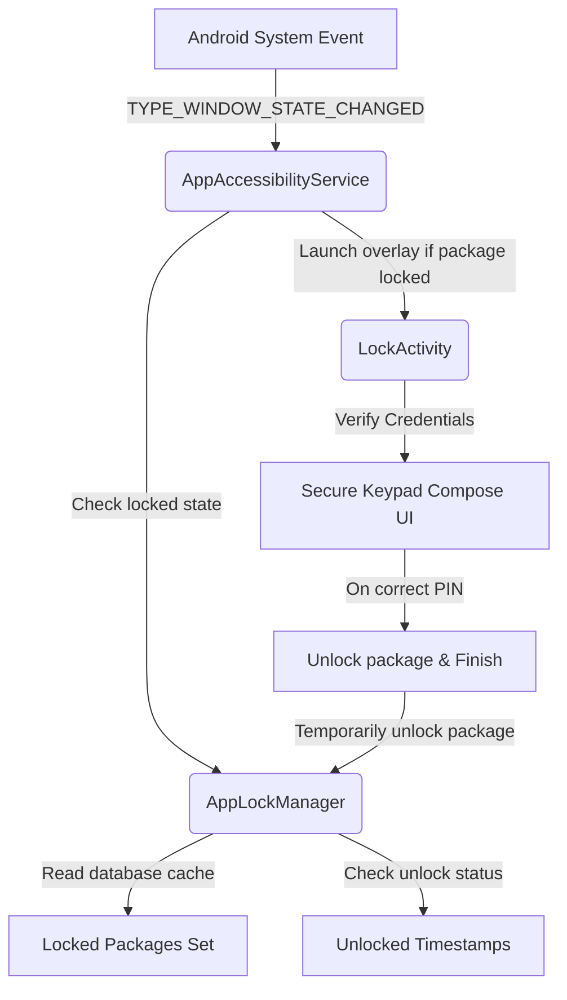

# Privacy Lock Wiki

Welcome to the official **Privacy Lock** documentation. This wiki serves as a comprehensive resource for users, developers, open-source contributors, and security researchers. 

Privacy Lock is an offline-first Android security application built with modern Kotlin and Jetpack Compose. It allows users to lock applications using a secure 6-digit Primary PIN, a decoy PIN for forced-disclosure scenarios, a panic PIN for emergency shut-down, and Android Biometrics. It relies on the Android Accessibility Service to detect foreground package transitions in real-time and display a highly responsive Material 3 secure overlay.

---

## Table of Contents

* **Getting Started**
  * [[Installation]] — System requirements, hardware targets, and quick-start guides.
  * [[Features]] — Comprehensive feature tour, deniability profiles, and matrices.
  * [[Build Instructions]] — How to compile, local environment configurations, and `.env` setup.
* **Architecture & Internals**
  * [[Architecture]] — MVVM system patterns, data flows, and flow-based presentation models.
  * [[Accessibility Service]] — Deep system event integration, package filters, and reliability optimizations.
  * [[Lock Engine]] — Lock lifecycles, cache mechanics, overlay flags, and double-back blockades.
  * [[Database]] — Local Room SQLite table schemas, entity configurations, and transactional migrations.
* **Security & Auditing**
  * [[Security Model]] — Zero-knowledge local schemas, PIN hashes, and threat mitigation properties.
  * [[Privacy Center]] — Interactive audit logging, timeline telemetry, and intruder alert systems.
  * [[Settings]] — User-customizable configs, haptic triggers, and backup profiles.
* **Project Governance & CI/CD**
  * [[CI/CD Pipeline]] — Automated GitHub Actions triggers, linter analysis, and binary builds.
  * [[Developer Guide]] — Core packages breakdown, class structures, and code style conventions.
  * [[Project Board]] — Agile board, custom attributes, custom workflows, and task backlog.
  * [[Release Process]] — Build targets, F-Droid metadata, and repository version alignment.
  * [[Roadmap]] — Development goals, version milestones, and feature scheduling.
* **Support & FAQ**
  * [[Troubleshooting]] — Known issue diagnostic steps, battery whitelists, and log checks.
  * [[FAQ]] — Comprehensive list of 30 frequently asked questions.

---

## 🎨 2. Comprehensive Navigation Map

| Section | Target File Link | Core Subject |
| :--- | :--- | :--- |
| **Home** | [[Home]] | Project portal, layout graphs, and general capabilities. |
| **Installation** | [[Installation]] | Standard machine setup, JDK specifications, and basic directory configuration. |
| **Features** | [[Features]] | Detailed outline of credential states, overlays, and device safety indicators. |
| **Architecture** | [[Architecture]] | Clean MVVM models, Flow states, and real-time interaction sequences. |
| **Security Model** | [[Security Model]] | SHA-256 properties, dynamic screenshot blocking, and randomized keypad vectors. |
| **Accessibility Service** | [[Accessibility Service]] | Background system state transitions, event dispatch, and battery profiles. |
| **Lock Engine** | [[Lock Engine]] | Thread-safe memory cached matching, overlay parameters, and Home gestures. |
| **Database** | [[Database]] | Room Persistence schemas, DAOs, reactive streams, and database migration rules. |
| **Privacy Center** | [[Privacy Center]] | Dynamic safety dashboards, historical logs, and visual incident timelines. |
| **Settings** | [[Settings]] | Global app properties, custom system behaviors, and text backups. |
| **Build Instructions** | [[Build Instructions]] | Gradle tasks, compilation parameters, and secure environment setups. |
| **CI/CD Pipeline** | [[CI/CD Pipeline]] | Automated workflow specifications, caching policies, and Dependabot rules. |
| **Troubleshooting** | [[Troubleshooting]] | Platform sleep Whitelisting, diagnostics, and build recovery procedures. |
| **FAQ** | [[FAQ]] | 30 frequently asked questions and detailed conceptual clarifications. |
| **Developer Guide** | [[Developer Guide]] | Extensibility points, package lists, and repository contribution workflows. |
| **Release Process** | [[Release Process]] | Publishing schemas, signing rules, and package version alignments. |
| **Roadmap** | [[Roadmap]] | Four-phase release timeline, features backlog, and future deliverables. |

---

## System Overview

Privacy Lock runs entirely client-side. The diagram below represents the relationship between the Android System, the `AppAccessibilityService`, the `AppLockManager` state cache, and the `LockActivity` UI.

---

## Key Security Features

* **Advanced Layout Configuration**: Implements the standard Android PIN pad layout ($1$-$2$-$3$ grid with $0$ centered on the bottom row) with support for layout-randomization.
* **Multi-Credential Shielding**: Supports Primary, Decoy (fake crash simulation), and Panic (instant desktop exit) PINs.
* **Active Protection**: Integrates dynamic `FLAG_SECURE` configuration to block screen captures, video recording, and recent-app previews immediately.
* **Offline Intruder Logger**: Catches unauthorized access attempts locally using SQLite (Room) with customized visual avatar generation to represent intruder logs.

---

[Back to Top](#privacy-lock-wiki) | [Proceed to Installation Guide >>](Installation)
