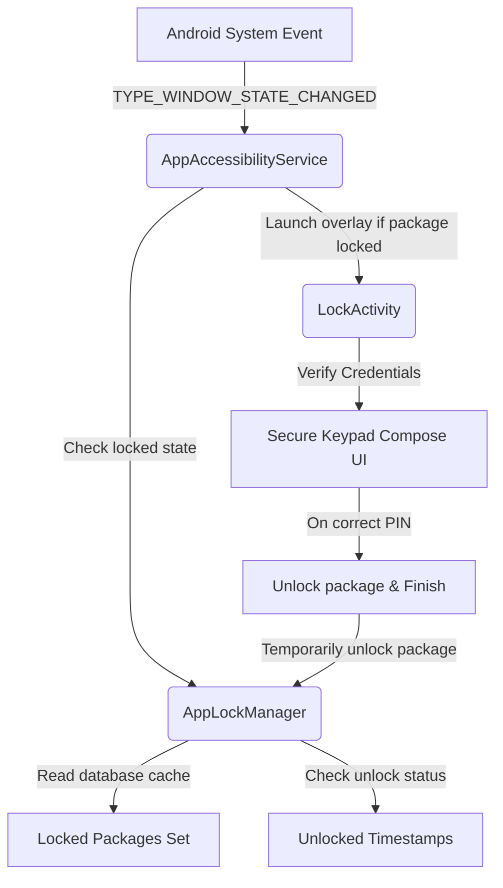

# Privacy Lock Wiki

Welcome to the official **Privacy Lock** documentation. This wiki serves as a comprehensive resource for users, developers, open-source contributors, and security researchers. 

Privacy Lock is an offline-first Android security application built with modern Kotlin and Jetpack Compose. It allows users to lock applications using a secure 6-digit Primary PIN, a decoy PIN for forced-disclosure scenarios, a panic PIN for emergency shut-down, and Android Biometrics. It relies on the Android Accessibility Service to detect foreground package transitions in real-time and display a highly responsive Material 3 secure overlay.

---

## Table of Contents

* **Getting Started**
  * [[Installation]] — System requirements, build commands, and troubleshooting.
  * [[Getting Started]] — Initial setup, permission wizard, and creating your first lock.
* **Architecture & Internals**
  * [[Architecture]] — MVVM structure, state synchronization, and Room database flows.
  * [[Project Structure]] — Detailed package breakdown of the codebase.
  * [[App Lock Engine]] — Accessibility service implementation, package detection, and overlay life cycle.
  * [[Database]] — Schema definitions, Entity designs, and backup/restore serialization.
* **Security & Configuration**
  * [[Security]] — PIN hashing algorithms, biometric bypasses, and screenshot shielding.
  * [[Permissions]] — Explanations and configurations for Accessibility, Usage Access, and Overlay.
  * [[Settings]] — In-depth specifications for all in-app customization options.
* **Resources & Support**
  * [[User Guide]] — End-user manual and navigation flows.
  * [[FAQ]] — Comprehensive list of 30 frequently asked questions.
  * [[Troubleshooting]] — Known issues and diagnostic steps.
* **Project Governance**
  * [[Contributing]] — Guidelines for code, styles, and testing.
  * [[GitHub Workflow]] — Branch management, CI/CD, and release actions.
  * [[Release Process]] — How updates are packaged and published.
  * [[Changelog]] — Release history and design iteration notes.
  * [[Roadmap]] — Development goals and planned improvements.
* **Reference & Legal**
  * [[API Reference]] — Key interface, helper, and class documentation.
  * [[Developer Guide]] — Technical details for extending capabilities.
  * [[License]] — Legal usage rights.
  * [[Privacy Policy]] — On-device data guarantees.
  * [[Security Policy]] — Vulnerability reporting and updates.

---

## System Overview

Privacy Lock runs entirely client-side. The diagram below represents the relationship between the Android System, the `AppAccessibilityService`, the `AppLockManager` state cache, and the `LockActivity` UI.

---

## Key Security Features

* **Advanced Layout Configuration**: Implements the standard Android PIN pad layout ($1$-$2$-$3$ grid with $0$ centered on the bottom row) with support for layout-randomization.
* **Multi-Credential Shielding**: Supports Primary, Decoy (fake crash simulation), and Panic (instant desktop exit) PINs.
* **Active Protection**: Integrates dynamic `FLAG_SECURE` configuration to block screen captures, video recording, and recent-app previews immediately.
* **Offline Intruder Logger**: Catches unauthorized access attempts locally using SQLite (Room) with customized visual avatar generation to represent intruder logs.

---

[Back to Top](#privacy-lock-wiki) | [Proceed to Installation Guide >>](Installation)
